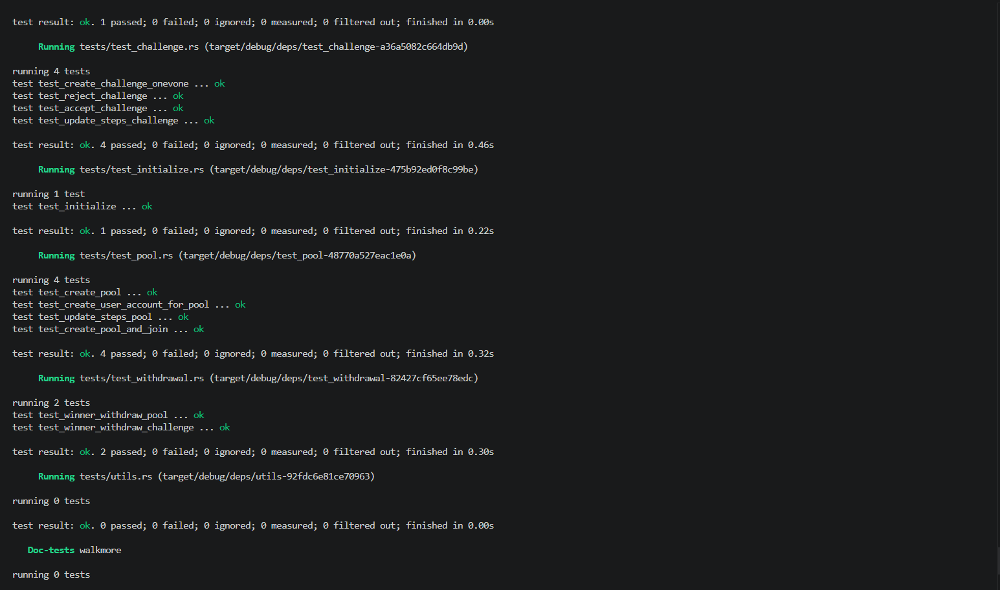

# Walkmore Program



---

## Clone Repository

```bash
git clone https://github.com/Nikuunj/Walkmore
cd Walkmore
```

---

## Devnet

Program Id: 2147VBdRR2xGS6BnY8RsprPhh4MHPoApgnzqgNm2LLFu

Signature: 9KbVdLat2PEeJhF6h3J9uWSgAEQHeyF7tMaANcTm2DFScqUgX9Q94JR5izCqpn6cRJbgKaiuxfKmqyqaT7j8D9J

---

# Installation

## Windows

Install WSL first.

Recommended:

- WSL2
- Ubuntu 22+

---

## macOS / Linux

Install Solana CLI and Anchor using the standard installer:

```bash
curl --proto '=https' --tlsv1.2 -sSfL https://solana-install.solana.workers.dev | bash
```

After installation restart your terminal.

---

## Recommended Versions

```bash
Rust: rustc 1.85.0
Solana CLI: solana-cli 3.1.10
Anchor CLI: anchor-cli 1.0.2
```

---

# Project Structure

```bash
.
├── app/
├── migrations/
├── programs/
│   └── walkmore/
├── public/
├── Anchor.toml
├── Cargo.toml
└── README.md
```

---

# Build

Build the Anchor program:

```bash
anchor build
```

---

# Test

Run the full test suite:

```bash
anchor test
```

Run tests without rebuilding:

```bash
anchor test --skip-build
```

Run a single test file:

```bash
anchor test -- --test test_withdrawal
```

---

# Walkmore Overview

`Walkmore` is a Solana Anchor program that implements user pools and one-vs-one challenges.
Users can create/join pools, accept challenges, update step counts, and withdraw rewards after completion.

---

# Core Concepts

## Pools

- A pool is created by a maker.
- Users join by depositing tokens into a pool vault.
- Each user has a `user_data` account that tracks steps and completion.
- Winners withdraw token rewards based on pool rules.

## Challenges

- A one-vs-one challenge is created between two players.
- Both players stake tokens into a challenge vault.
- Players update their step counts during the challenge.
- The winner withdraws the challenge reward after the challenge ends.
- Challenges can also be closed when tied or completed.

---

# Account Structure

## Key PDAs

- `pool` account: `[b"pool", maker.key().as_ref(), seed.to_le_bytes().as_ref()]`
- `user_data` account: `[b"user_data", user.key().as_ref(), pool.key().as_ref()]`
- `challenge` account: `[b"challenge", seed.to_le_bytes().as_ref()]`
- `challenge user_data`: `[b"user_data", player.key().as_ref(), challenge.key().as_ref()]`

---

# Common Instructions

- `CreatePool`
- `CreateUserAccount`
- `JoinPool`
- `UpdateStepsPool`
- `CreateChallengeOneVOne`
- `AcceptChallenge`
- `UpdateStepsChallenge`
- `WinnerWithdrawPool`
- `WinnerWithdrawOneVOne`
- `CloseChallenge`

---

# Test Notes

Tests are located under `programs/walkmore/tests/`.
The test harness uses LiteSVM to simulate the Solana runtime and exercise the Anchor program.

